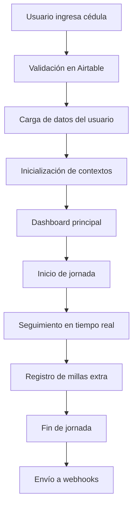

# 📊 Sistema de Control Laboral y Nómina

## 📋 Descripción del Proyecto

**Sistema de Control Laboral y Nómina** es una aplicación web moderna desarrollada con React, TypeScript y Vite que permite a los empleados registrar y gestionar su jornada laboral, horas trabajadas y millas extra de manera automatizada. El sistema integra autenticación con Airtable, seguimiento de tiempo en tiempo real, y envío de datos a través de webhooks.

### 🎯 Objetivo Principal

Digitalizar y automatizar el proceso de control de asistencia laboral, eliminando métodos manuales y proporcionando datos precisos en tiempo real para la gestión de nómina y recursos humanos.

## ✨ Características Principales

### 🔐 Autenticación Dinámica
- **Integración con Airtable**: Validación de usuarios contra base de datos corporativa
- **Información completa**: Carga automática de nombre, cédula, cargo y área
- **Persistencia de sesión**: Mantenimiento del estado de autenticación

### ⏱️ Seguimiento de Tiempo Real
- **Registro automático**: Inicio y fin de jornada con timestamp preciso
- **Cálculo dinámico**: Horas trabajadas calculadas automáticamente
- **Actualización en vivo**: Contadores que se actualizan cada minuto
- **Persistencia local**: Datos almacenados en localStorage por usuario

### 📊 Dashboard Inteligente
- **Resumen semanal**: Progreso hacia las 40 horas objetivo
- **Estado actual**: Indicador en tiempo real del estado laboral
- **Millas extra**: Contador diario y semanal de actividades adicionales
- **Métricas visuales**: Barras de progreso y badges informativos

### 🎙️ Registro de Millas Extra
- **Grabación de audio**: Captura de testimonios mediante MediaRecorder API
- **Procesamiento automático**: Conversión a Base64 para envío
- **Integración completa**: Suma automática al contador de millas extra

### 📤 Integración de Webhooks
- **Envío automático**: Datos enviados a endpoints configurados
- **Múltiples webhooks**: Diferentes endpoints para diferentes tipos de datos
- **Formato estructurado**: JSON con metadata temporal y de usuario

## 🛠️ Stack Tecnológico

### Frontend
- **React 18**: Biblioteca de interfaz de usuario con hooks modernos
- **TypeScript**: Tipado estático para mayor robustez del código
- **Vite**: Build tool moderno para desarrollo rápido
- **Tailwind CSS**: Framework de utilidades CSS para diseño responsivo
- **Shadcn/ui**: Componentes de UI consistentes y accesibles

### Gestión de Estado
- **React Context API**: Manejo global del estado de autenticación y trabajo
- **Custom Hooks**: Lógica reutilizable para operaciones específicas
- **LocalStorage**: Persistencia local de datos de trabajo

### APIs y Servicios
- **Airtable API**: Base de datos para información de empleados
- **MediaRecorder API**: Captura de audio nativa del navegador
- **Fetch API**: Comunicación con webhooks externos

### Herramientas de Desarrollo
- **ESLint**: Linting para mantener calidad del código
- **PostCSS**: Procesamiento de CSS
- **Git**: Control de versiones

## 🏗️ Arquitectura del Sistema

### Estructura de Directorios
```
src/
├── components/           # Componentes reutilizables
│   ├── ui/              # Componentes base de interfaz
│   ├── AppLayout.tsx    # Layout principal de la aplicación
│   ├── LoginForm.tsx    # Formulario de autenticación
│   ├── UserInfoCard.tsx # Tarjeta de información del usuario
│   ├── WeeklySummary.tsx # Dashboard de resumen semanal
│   ├── WorkdayControl.tsx # Control de jornada laboral
│   └── ExtraMileForm.tsx # Formulario de millas extra
├── contexts/            # Contextos de React para estado global
│   ├── AuthContext.tsx  # Manejo de autenticación
│   ├── AppContext.tsx   # Estado general de la aplicación
│   └── WorkContext.tsx  # Gestión de datos de trabajo
├── hooks/               # Custom hooks reutilizables
├── lib/                 # Utilidades y configuraciones
├── pages/               # Páginas principales
└── main.tsx            # Punto de entrada de la aplicación
```

### Flujo de Datos



## 🔧 Configuración e Instalación

### Prerrequisitos
- Node.js >= 18.0.0
- npm >= 8.0.0
- Cuenta de Airtable con API key
- Base de datos configurada en Airtable

### Variables de Entorno
Crear archivo `.env.local` en la raíz del proyecto:

```bash
# Configuración de Airtable
VITE_AIRTABLE_API_KEY=your_airtable_api_key
VITE_AIRTABLE_BASE_ID=your_airtable_base_id
```

### Instalación

```bash
# Clonar el repositorio
git clone [repository-url]
cd novedades-nomina

# Instalar dependencias
npm install

# Configurar variables de entorno
cp .env.example .env.local
# Editar .env.local con tus credenciales

# Ejecutar en modo desarrollo
npm run dev

# Construir para producción
npm run build

# Vista previa de producción
npm run preview
```

## 📊 Modelo de Datos

### Base de Datos (Airtable)
Tabla requerida: `Nomina Sirius`

| Campo | Tipo | Descripción |
|-------|------|-------------|
| Cedula | Text | Número de identificación (campo clave) |
| Nombre | Text | Nombre completo del empleado |
| Cargo | Text | Posición laboral |
| Area | Text | Departamento o área de trabajo |

### Estructura de Datos Local

#### WorkEntry
```typescript
interface WorkEntry {
  id: string;              // Identificador único
  date: string;            // Fecha en formato YYYY-MM-DD
  startTime: string;       // Hora de inicio (HH:MM:SS)
  endTime: string | null;  // Hora de fin (HH:MM:SS)
  hoursWorked: number;     // Horas trabajadas calculadas
  extraMiles: number;      // Millas extra del día
  isActive: boolean;       // Estado activo de trabajo
}
```

#### WeeklyData
```typescript
interface WeeklyData {
  totalHours: number;        // Total de horas semanales
  targetHours: number;       // Objetivo semanal (40h)
  dailyExtraMiles: number;   // Millas extra del día actual
  weeklyExtraMiles: number;  // Total de millas extra semanales
  isCurrentlyActive: boolean; // Estado actual de trabajo
  currentWeekEntries: WorkEntry[]; // Entradas de la semana
}
```
### Formato de Datos Enviados

#### Jornada Laboral
```json
{
  "cedula": "12345678",
  "startTime": "08:00:00",
  "lunchStart": "12:00:00",
  "lunchEnd": "13:00:00",
  "endTime": "17:00:00"
}
```

#### Millas Extra
```json
{
  "cedula": "12345678",
  "audioData": "data:audio/webm;base64,GkXfo...",
  "type": "extra_mile",
  "timestamp": "2025-07-09T15:30:00.000Z"
}
```

## 🔄 Flujos de Trabajo

### 1. Proceso de Autenticación
1. Usuario ingresa número de cédula
2. Sistema consulta Airtable con filtro por cédula
3. Si existe, carga datos completos del usuario
4. Inicializa contextos con información del usuario
5. Redirige al dashboard principal

### 2. Seguimiento de Jornada Laboral
1. Usuario inicia jornada desde el dashboard
2. Sistema registra timestamp de inicio
3. Inicia contador de tiempo en tiempo real
4. Permite pausas para almuerzo
5. Al finalizar, calcula horas totales y envía a webhook

### 3. Registro de Millas Extra
1. Usuario inicia grabación de audio
2. MediaRecorder captura audio en tiempo real
3. Al detener, convierte audio a Base64
4. Envía datos al webhook de millas extra
5. Actualiza contador local de millas extra

## 🧪 Testing y Calidad

### Validaciones Implementadas
- **Autenticación**: Verificación de cédula en base de datos
- **Permisos**: Validación de acceso al micrófono
- **Datos**: Verificación de completitud antes de envío
- **Estado**: Validación de estados de componentes

### Manejo de Errores
- **Red**: Manejo de fallos de conectividad
- **Permisos**: Gestión de permisos de navegador
- **Datos**: Validación de integridad de información
- **UI**: Feedback visual para todos los estados

## 🚀 Deployment

### Build de Producción
```bash
npm run build
```

### Configuración de Servidor
- Servidor estático compatible (Nginx, Apache, Vercel, Netlify)
- Configuración de variables de entorno en el hosting
- Certificado SSL requerido para funcionalidades de grabación

### Consideraciones de Seguridad
- API keys en variables de entorno
- Validación de datos en cliente y servidor
- Comunicación HTTPS obligatoria
- Limpieza de datos sensibles en logs

## 📈 Métricas y Monitoring

### Datos Capturados
- Horas trabajadas por usuario y período
- Cantidad de millas extra por día/semana
- Patrones de uso de la aplicación
- Tiempos de jornada laboral

### KPIs del Sistema
- Precisión en el registro de tiempo
- Adopción del sistema por parte de usuarios
- Calidad de datos enviados a webhooks
- Uptime y disponibilidad del sistema

## 🤝 Contribución

### Guías de Desarrollo
1. Fork del repositorio
2. Crear branch feature (`git checkout -b feature/nueva-funcionalidad`)
3. Commit cambios (`git commit -am 'Agregar nueva funcionalidad'`)
4. Push al branch (`git push origin feature/nueva-funcionalidad`)
5. Crear Pull Request

### Estándares de Código
- TypeScript estricto
- Componentes funcionales con hooks
- Nombres descriptivos en español
- Comentarios en código crítico
- Testing de funcionalidades principales

## 📝 Licencia

Este proyecto es propietario de Sirius. Todos los derechos reservados.

## 📞 Soporte y Contacto

Para soporte técnico o consultas sobre el sistema, contactar al equipo de desarrollo.

---

**Desarrollado con ❤️ para Sirius** - Sistema de Control Laboral v1.0
