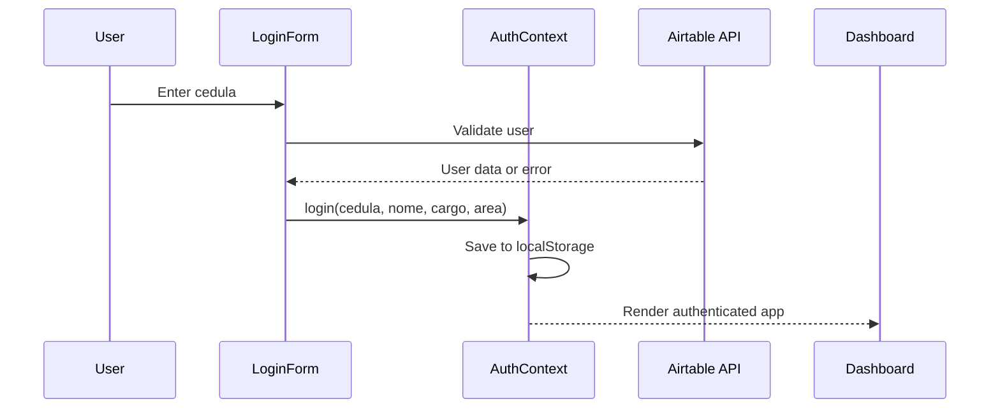
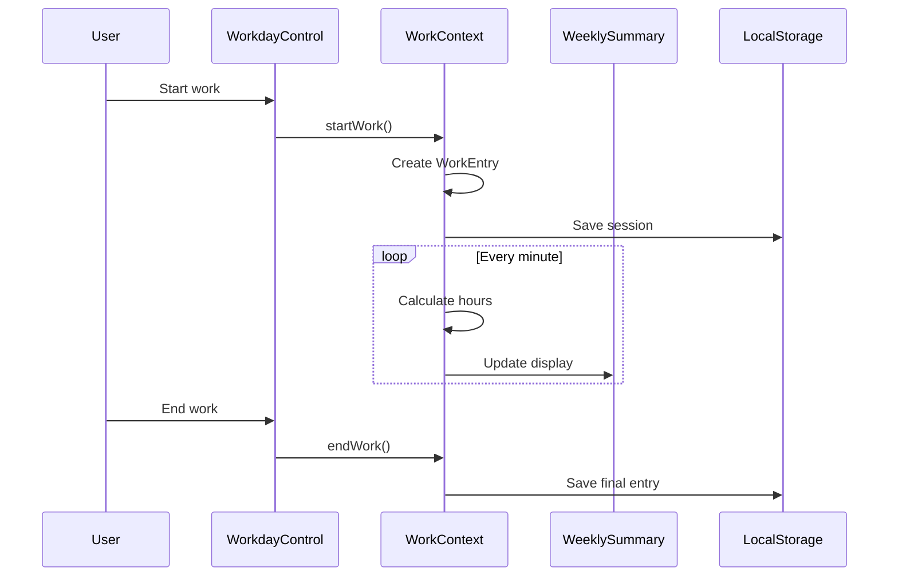
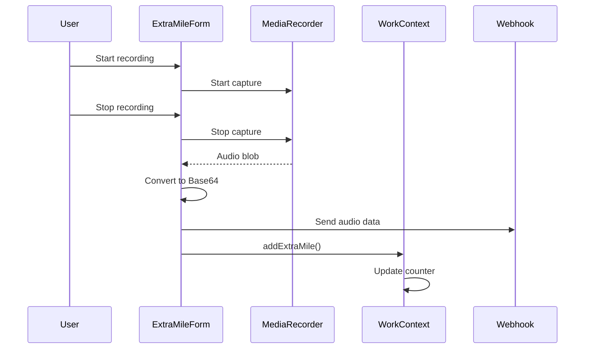

# 🔧 Technical Architecture

## 🏗️ System Overview

The **Sistema de Control Laboral y Nómina** is a modern web application built with a component-based architecture using React 18, TypeScript, and Vite. The system implements a real-time workforce management solution with persistent data storage and external API integration.

## 🎯 Architecture Principles

### 1. Separation of Concerns
- **Presentation Layer**: React components with Tailwind CSS
- **Business Logic**: Custom hooks and context providers
- **Data Layer**: LocalStorage persistence with Airtable integration
- **Communication Layer**: RESTful API calls and webhook integration

### 2. State Management Strategy
- **Global State**: React Context API for authentication and work data
- **Local State**: Component-level state with useState hooks
- **Persistent State**: LocalStorage for offline data persistence
- **Remote State**: Airtable API for user validation and data retrieval

### 3. Real-time Updates
- **Time Tracking**: Interval-based updates every minute
- **UI Reactivity**: Automatic re-renders on state changes
- **Data Synchronization**: Context providers ensure consistency
- **Event-driven Architecture**: User actions trigger state updates

## 🔍 Component Architecture

### Core Components Hierarchy

```
App
├── AuthProvider
│   ├── WorkProvider
│   │   ├── AppProvider
│   │   │   └── IndexContent
│   │   │       ├── LoginForm (unauthenticated)
│   │   │       └── AppLayout (authenticated)
│   │   │           ├── Header
│   │   │           └── Main
│   │   │               ├── UserInfoCard
│   │   │               ├── WeeklySummary
│   │   │               ├── WorkdayControl
│   │   │               └── ExtraMileForm
```

### Component Responsibilities

#### 🔐 AuthProvider (`/contexts/AuthContext.tsx`)
```typescript
interface AuthContextType {
  isAuthenticated: boolean;
  userInfo: UserInfo | null;
  userCedula: string | null;
  login: (cedula: string, nombre?: string, cargo?: string, area?: string) => void;
  logout: () => void;
}
```
**Responsibilities:**
- User authentication state management
- Airtable API integration for user validation
- Persistent session management via localStorage
- User information storage and retrieval

#### ⏱️ WorkProvider (`/contexts/WorkContext.tsx`)
```typescript
interface WorkContextType {
  weeklyData: WeeklyData;
  startWork: () => void;
  endWork: () => void;
  addExtraMile: () => void;
  isWorking: boolean;
  currentEntry: WorkEntry | null;
  refreshData: () => void;
}
```
**Responsibilities:**
- Real-time work session tracking
- Hours calculation and aggregation
- Extra miles counter management
- Weekly data summarization
- localStorage persistence by user

#### 📊 WeeklySummary (`/components/WeeklySummary.tsx`)
**Responsibilities:**
- Display weekly work progress
- Real-time progress bar updates
- Work status indicator (active/inactive)
- Extra miles counter visualization
- Manual data refresh functionality

#### ⏱️ WorkdayControl (`/components/WorkdayControl.tsx`)
**Responsibilities:**
- Work session start/stop controls
- Lunch break time tracking
- Real-time hours display
- Webhook data transmission
- Local state persistence

#### 🎙️ ExtraMileForm (`/components/ExtraMileForm.tsx`)
**Responsibilities:**
- Audio recording via MediaRecorder API
- Base64 audio encoding
- Extra mile submission to webhook
- Integration with work counter system

## 🔄 Data Flow Architecture

### 1. Authentication Flow


### 2. Work Tracking Flow


### 3. Extra Mile Flow


## 💾 Data Persistence Strategy

### LocalStorage Schema
```javascript
// User-specific keys
`work_${cedula}_entry_${date}` -> WorkEntry
`work_${cedula}_active_session` -> WorkEntry
`userInfo` -> UserInfo
`userCedula` -> string
```

### Data Structures

#### WorkEntry
```typescript
interface WorkEntry {
  id: string;              // Unique identifier
  date: string;            // ISO date string (YYYY-MM-DD)
  startTime: string;       // Time string (HH:MM:SS)
  endTime: string | null;  // Time string or null if active
  hoursWorked: number;     // Calculated hours (decimal)
  extraMiles: number;      // Count of extra miles for the day
  isActive: boolean;       // Current work status
}
```

#### WeeklyData
```typescript
interface WeeklyData {
  totalHours: number;        // Sum of all hours in current week
  targetHours: number;       // Weekly target (40 hours)
  dailyExtraMiles: number;   // Extra miles for current day
  weeklyExtraMiles: number;  // Sum of extra miles for week
  isCurrentlyActive: boolean; // Real-time work status
  currentWeekEntries: WorkEntry[]; // All entries for current week
}
```

## 🎨 UI/UX Architecture

### Design System
- **Component Library**: Shadcn/ui for consistent components
- **Styling**: Tailwind CSS utility-first approach
- **Typography**: System fonts with readable hierarchy
- **Color Scheme**: Professional blue/gray palette with semantic colors
- **Responsive Design**: Mobile-first approach with breakpoint system

### State-driven UI
```typescript
// Example: Button state management
{isRecording ? (
  <Button variant="destructive">Stop Recording</Button>
) : (
  <Button variant="outline">Start Recording</Button>
)}
```

### Visual Feedback System
- **Loading States**: Spinners and disabled states
- **Success States**: Green indicators and toast notifications
- **Error States**: Red indicators with descriptive messages
- **Progress Indicators**: Real-time progress bars and counters

## 🔌 Integration Architecture

### External APIs

#### Airtable Integration
```typescript
const AIRTABLE_API_URL = `https://api.airtable.com/v0/${BASE_ID}/${TABLE_NAME}`;
const headers = {
  'Authorization': `Bearer ${API_KEY}`
};
```


### Audio Processing Pipeline
```typescript
navigator.mediaDevices.getUserMedia({ audio: true })
  .then(stream => new MediaRecorder(stream))
  .then(recorder => recorder.start())
  .then(dataAvailable => collectChunks())
  .then(stop => createBlob())
  .then(blob => convertToBase64())
  .then(base64 => sendToWebhook());
```

## 🛡️ Security Architecture

### Data Protection
- **Client-side Validation**: Input sanitization and validation
- **Environment Variables**: Sensitive data in environment files
- **API Key Management**: Secure storage and rotation policies
- **Local Storage**: User-specific data isolation

### Network Security
- **HTTPS Only**: Required for MediaRecorder API
- **CSP Headers**: Content Security Policy implementation
- **API Rate Limiting**: Controlled request frequency
- **CORS Configuration**: Proper cross-origin resource sharing

## 📊 Performance Architecture

### Optimization Strategies
- **Code Splitting**: Dynamic imports for route-based splitting
- **Lazy Loading**: Components loaded on demand
- **Memoization**: React.memo and useMemo for expensive operations
- **Bundle Analysis**: Regular bundle size monitoring

### Real-time Performance
```typescript
// Efficient time updates
useEffect(() => {
  const interval = setInterval(() => {
    if (isWorking) updateHours();
  }, 60000); // Update every minute, not every second
  
  return () => clearInterval(interval);
}, [isWorking]);
```

### Memory Management
- **Cleanup Effects**: Proper resource cleanup on unmount
- **Stream Management**: MediaRecorder stream cleanup
- **State Optimization**: Minimal re-renders through context splitting

## 🧪 Testing Architecture

### Testing Strategy
- **Unit Tests**: Component and utility function testing
- **Integration Tests**: Context provider and hook testing
- **E2E Tests**: Full user workflow testing
- **Performance Tests**: Bundle size and runtime performance

### Quality Assurance
- **TypeScript**: Compile-time type checking
- **ESLint**: Code quality and consistency
- **Prettier**: Code formatting
- **Husky**: Pre-commit hooks for quality gates

---

**Technical Architecture v1.0** - Sistema de Control Laboral
